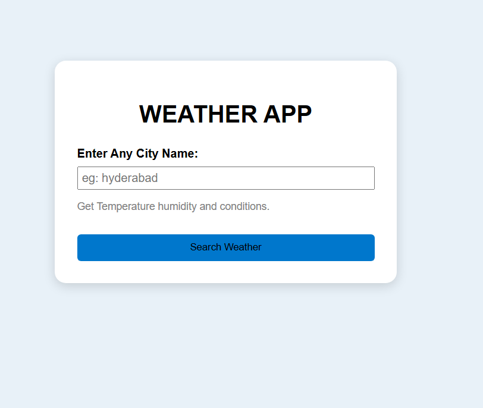
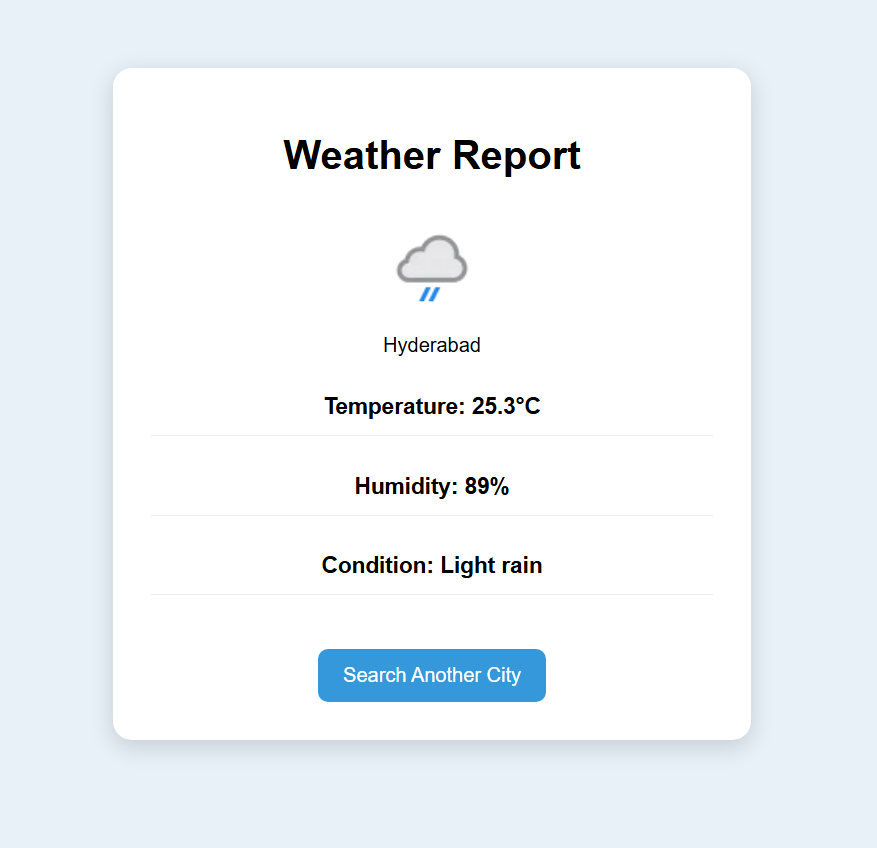

# 🌦️ Weather App

A simple and responsive weather application built with **Flask** that fetches real-time weather information using the **WeatherAPI**.

Users can search for any city and instantly view its current temperature, humidity, weather condition, and weather icon.

---

## ✨ Features

- 🔍 Search weather by city name
- 🌡️ Current temperature in Celsius
- 💧 Humidity information
- ☁️ Live weather condition
- 🌤️ Dynamic weather icons
- ❌ Invalid city handling
- 🎨 Simple and clean user interface

---

## 📸 Screenshots

### Home Page



### Weather Report



---

## 🛠️ Built With

- Python
- Flask
- HTML5
- CSS3
- Jinja2
- WeatherAPI
- Requests
- python-dotenv

---

## 📁 Project Structure

```text
weatherapp/
│
├── static/
│   └── style.css
│
├── templates/
│   ├── index.html
│   └── result.html
│
├── screenshots/
│   ├── home.png
│   └── result.png
│
├── app.py
├── requirements.txt
├── .env
├── .gitignore
└── README.md
```

---

## 🚀 Getting Started

### 1. Clone the repository

```bash
git clone https://github.com/your-username/weatherapp.git
cd weatherapp
```

### 2. Create a virtual environment

**Windows**

```bash
python -m venv env
env\Scripts\activate
```

**macOS / Linux**

```bash
python3 -m venv env
source env/bin/activate
```

### 3. Install dependencies

```bash
pip install -r requirements.txt
```

### 4. Create a `.env` file

```env
API_KEY=YOUR_WEATHERAPI_KEY
```

Get your free API key from:

https://www.weatherapi.com/

### 5. Run the application

```bash
python app.py
```

Open your browser and visit:

```
http://127.0.0.1:5000
```

---

## 📌 How It Works

1. Enter the name of any city.
2. Click **Search Weather**.
3. The application sends a request to the WeatherAPI.
4. Current weather details are displayed, including:
   - 📍 Location
   - 🌡️ Temperature
   - 💧 Humidity
   - ☁️ Weather condition
   - 🌤️ Weather icon

If an invalid city is entered, the application displays an appropriate error message.

---

## 📦 Requirements

```text
Flask
Requests
python-dotenv
Jinja2
Werkzeug
```

Install all dependencies with:

```bash
pip install -r requirements.txt
```

---

## 🚀 Future Improvements

- 📅 7-Day Weather Forecast
- 📍 Detect User Location
- 🌙 Dark Mode
- 💨 Wind Speed & Pressure
- 🌅 Sunrise & Sunset Details
- 🌎 Search History
- 📱 Improved Mobile Responsiveness

---

## 👨‍💻 Author

**Vikas Sagar**

GitHub: https://github.com/vikassagar-creator

---

## 📄 License

This project is open source and available under the **MIT License**.
